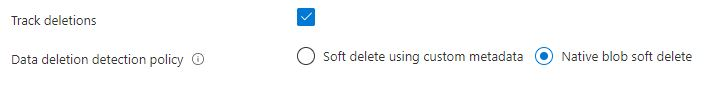

There are certain [conditions](https://docs.microsoft.com/en-us/azure/search/search-howto-reindex#rebuild-conditions) that will require a drop and rebuild of the index. I have recently been investigating ways that this could be achieved as part of the deployment pipeline.

My initial approach was to tackle this via the azure cli as there are no bicep templates available (yet?). This worked ok for the initial approach as I just dropped and created an index with the same name. This doesn't really work too well when pushing to a production environment as there will be some downtime on the index.

Microsoft have recently introduced the concept of an [index alias](https://docs.microsoft.com/en-us/azure/search/search-how-to-alias?tabs=rest). I like to think of this like a proxy meaning that you point your client search service at the index alias and it will proxy it to the underlying index. This allows you to create a new index in the background and once its ready you can update the index alias to use the new index with no downtime.

This could have been achieved using the azure cli, however I am much more comfortable writing in C#. I decided to write a deployment tool as a C# console application.

As I was building this deployment tool, I noticed that an option was missing for the Azure Blob Storage data source.

The option looks like this in the Azure portal under the data source options.



I couldn't find this option anywhere in .NET SDK. After a lot of researching and looking for answers, I came across this GitHub issue [\#11435](https://github.com/Azure/azure-sdk-for-net/issues/11435). My understanding is that they don't have the resources to put towards a product that is currently in preview. The option is available through the [rest api](https://docs.microsoft.com/en-us/azure/search/search-howto-index-changed-deleted-blobs#how-to-configure-deletion-detection-using-native-soft-delete), so maybe I could alter the outgoing .NET SDK request and add the dataDeletionDetectionPolicy to the JSON body. Well, it is possible and here is the code.

```
public class NativeBlobSoftDeleteDeletionDetectionPolicy : HttpPipelinePolicy
{
    public override void Process(HttpMessage message, ReadOnlyMemory<HttpPipelinePolicy> pipeline)
    {
        throw new NotImplementedException();
    }

    public override async ValueTask ProcessAsync(HttpMessage message, ReadOnlyMemory<HttpPipelinePolicy> pipeline)
    {
        if (message.Request.Method == RequestMethod.Put && message.Request.Uri.Path.Contains("datasources"))
        {
            if (message.Request.Content is not null)
            {
                using var ms = new MemoryStream();
                await message.Request.Content.WriteToAsync(ms, CancellationToken.None);
                var rawOriginalContent = Encoding.UTF8.GetString(ms.ToArray());
                var originalContent = JsonNode.Parse(rawOriginalContent);
                if (originalContent is not null)
                {
                    originalContent["dataDeletionDetectionPolicy"] = new JsonObject
                    {
                        ["@odata.type"] = "#Microsoft.Azure.Search.NativeBlobSoftDeleteDeletionDetectionPolicy"
                    };

                    message.Request.Content = RequestContent.Create(originalContent.ToJsonString());
                }
            }
        }

        await ProcessNextAsync(message, pipeline);
    }
}
```